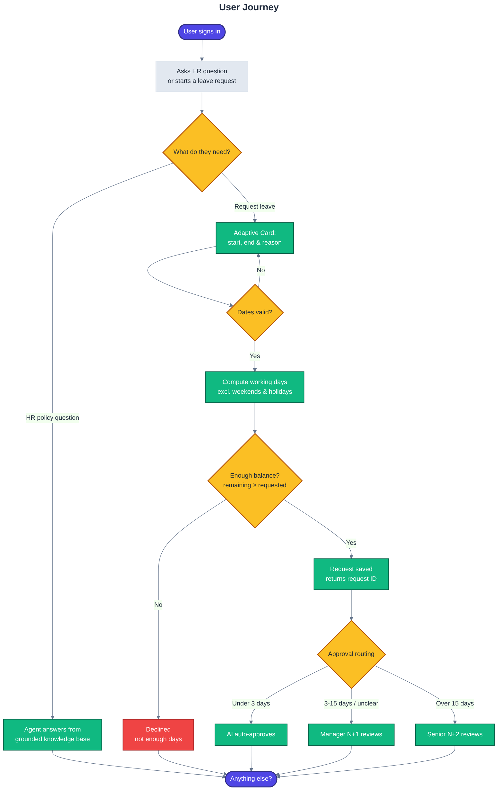
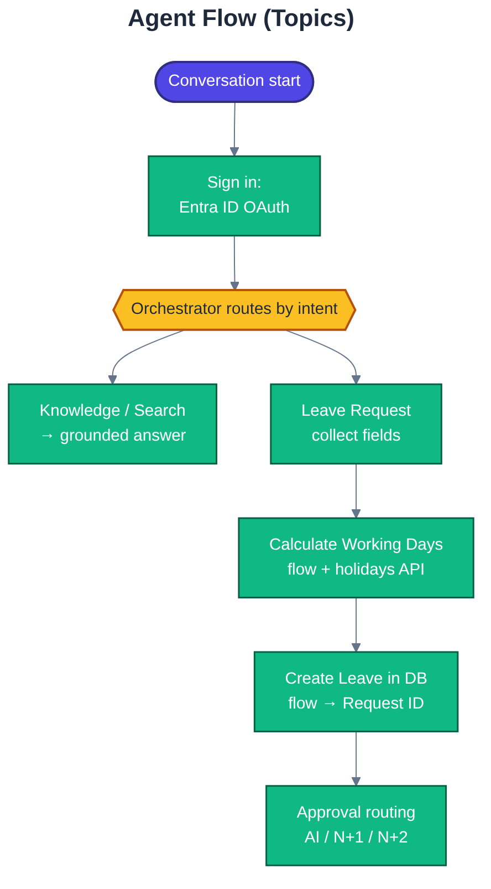
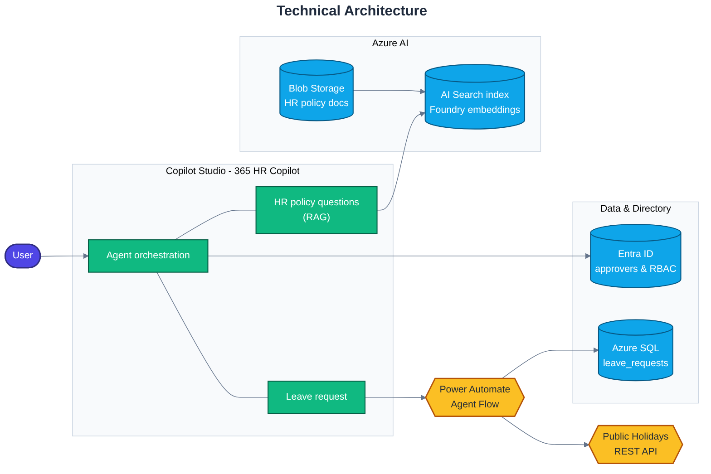
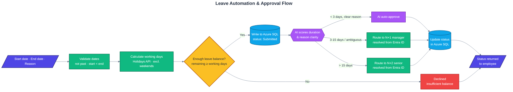

# Schema — 365 HR Copilot

## User journey

## Agent flow (topics)

Routing is **generative orchestration** — the agent follows its instructions and chooses the topic; this is not a hard-wired switch. After Entra ID sign-in, the orchestrator routes each turn to one of two skills: **Knowledge / Search** (grounded answer) or **Leave Request** (collect fields → working days → create → approval routing).

## Technical architecture

**Notes**
- On start, the agent signs the user in with **Entra ID** (Integrated auth) and enforces RBAC at the agent level.
- **HR policy questions (RAG):** policy documents in **Azure Blob Storage** are chunked, embedded with an **Azure AI Foundry** embedding model, and indexed for **semantic / vector** retrieval in **Azure AI Search**. Answers are grounded strictly in retrieved passages.
- **Leave request:** **Power Automate** computes working days against a public-holidays REST API, and an **Agent Flow** runs the AI + human approval stages (HITL).
- The leave request and its status are created and updated in **Azure SQL**.
- Approvers are resolved dynamically from the **Entra ID** directory at request time.

## Leave automation & approval flow

The agent collects the request fields, validates the dates, computes working days, checks them against the employee's **remaining leave balance**, then (if covered) persists the request and routes it through AI-assisted, human-in-the-loop approval — the final decision updates the status in Azure SQL.

**Balance check**
- If the employee's **remaining balance is less than the working days requested**, the request is **declined up front** — never saved or routed for approval.

**Approval routing**
- **Under 3 working days** with a clear, justified reason → **AI auto-approves**.
- **3–15 working days**, or an ambiguous reason, or a reason that doesn't match the duration → escalates to the **N+1 manager**.
- **Over 15 working days** → escalates to the **N+2 senior approver**.
